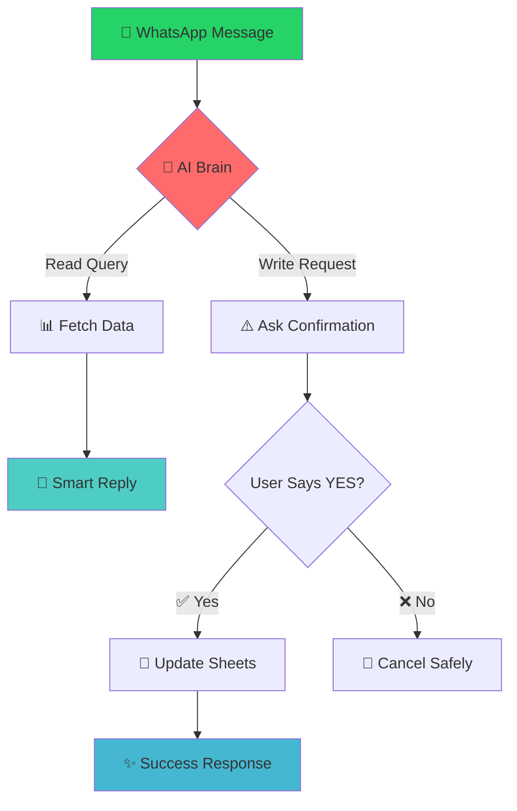
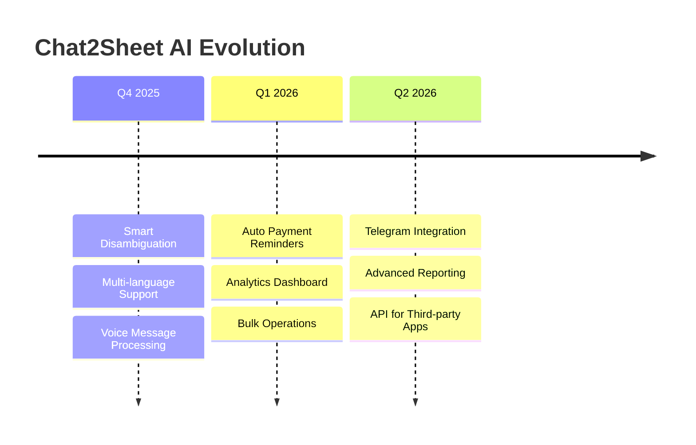

<div align="center">

# 🤖 Chat2Sheet AI

### _Where Conversations Meet Spreadsheets_

Transform casual WhatsApp chats into structured Google Sheets data — **no forms, no training, just talk.**

[✨ Features](#features) • [🚀 Quick Start](#quick-start) • [💬 Chat Examples](#examples) • [🔄 Flow](#how-it-works)

---

_"Add 10k for Aanya, Class 6, UPI today"_ → **Boom!** Your sheet is updated, balances calculated, confirmations sent.

</div>

---

## 🎯 The Magic



---

## ✨ Features

<table>
<tr>
<td width="50%">

### 🗣️ **Natural Language First**

- _"Fee status for Rohan"_
- _"Add 5000 cash for Priya today"_
- _"Show me Class 8 payments this month"_

No commands to memorize. Just chat.

</td>
<td width="50%">

### 🛡️ **Safety by Design**

- Confirms before any changes
- Shows exactly what will be saved
- Easy to cancel with "NO"

Your data stays protected.

</td>
</tr>
<tr>
<td>

### ⚡ **Smart Responses**

- Formatted, readable replies
- Balance calculations
- Payment summaries
- Class reports

Information you can actually use.

</td>
<td>

### 🎯 **Zero Learning Curve**

- Works on any WhatsApp
- No app downloads
- No new passwords
- Just add the bot number

Ready in 30 seconds.

</td>
</tr>
</table>

---

## 🔄 How It Works

```
┌─────────────────────────────────────────────────────────────────┐
│                         THE AI CONVERSATION FLOW                │
└─────────────────────────────────────────────────────────────────┘

📱 You: "Add 2500 for Riya, Class 7, cash today"
           │
           ▼
🧠 AI: Understands → Student: Riya | Amount: ₹2,500 | Mode: Cash
           │
           ▼
⚠️  AI: "Confirm to add ₹2,500 cash for Riya (Class 7) today?
        Reply YES to proceed"
           │
           ▼
📱 You: "YES"
           │
           ▼
✅ AI: "Added ✨ | Riya's new balance: ₹12,500 remaining"

┌─────────────────────────────────────────────────────────────────┐
│                         BEHIND THE SCENES                      │
└─────────────────────────────────────────────────────────────────┘

[WhatsApp] → [AI Parser] → [Confirmation] → [Google Sheets] → [Response]
     ↓             ↓              ↓               ↓              ↓
  Receives     Extracts      Asks user      Updates rows     Sends result
  message      intent &      to confirm     & calculates     back to chat
               details                      balances
```

---

## 💬 Examples

<details>
<summary><strong>💰 Adding Payments</strong></summary>

```
You: "Add 15000 for Aarav 9th class UPI today"
Bot: "Confirm to add ₹15,000 UPI payment for Aarav (Class 9) today? Reply YES"

You: "YES"
Bot: "Payment added ✅
     Student: Aarav (Class 9)
     Amount: ₹15,000 (UPI)
     New balance: ₹5,000 remaining"
```

</details>

<details>
<summary><strong>📊 Checking Status</strong></summary>

```
You: "Fee status Meera"
Bot: "📋 Meera's Fee Status
     Total Fees: ₹25,000
     Paid: ₹18,000
     Balance: ₹7,000
     Status: Pending
     Last payment: ₹5,000 on 15-Aug-2025"
```

</details>

<details>
<summary><strong>📈 Class Reports</strong></summary>

```
You: "Class 8 summary"
Bot: "📊 Class 8 Fee Summary
     Total Students: 25
     Total Collected: ₹4,50,000
     Outstanding: ₹1,25,000
     Fully Paid: 18 students
     Pending: 7 students"
```

</details>

---

## 🚀 Quick Start

### Prerequisites

- Node.js 18+
- WhatsApp Business API access
- Google Sheets API credentials
- Groq API key

### Installation

```bash
# Clone the magic
git clone https://github.com/yourusername/chat2sheet-ai
cd chat2sheet-ai

# Install dependencies
npm install

# Set up your environment
cp .env.example .env
# Fill in your API keys and credentials

# Start the AI
npm run dev  # Development with auto-reload
npm start    # Production
```

### Environment Setup

```env
PORT=3000
SPREADSHEET_ID=your_google_sheet_id
GOOGLE_CREDENTIALS_FILE=./credentials.json
GROQ_API_KEY=your_groq_api_key
WHATSAPP_ACCESS_TOKEN=your_whatsapp_token
WHATSAPP_PHONE_NUMBER_ID=your_phone_id
WHATSAPP_VERIFY_TOKEN=your_verify_token
```

---

## 🏗️ Architecture

```
┌─────────────────┐    ┌─────────────────┐    ┌─────────────────┐
│   WhatsApp      │    │   Chat2Sheet    │    │  Google Sheets  │
│   Messages      │◄──►│      AI         │◄──►│     Data        │
└─────────────────┘    └─────────────────┘    └─────────────────┘
                              │
                              ▼
                       ┌─────────────────┐
                       │   Groq AI       │
                       │   (Language     │
                       │   Understanding)│
                       └─────────────────┘
```

**Core Components:**

- 🎯 **Classifier**: Determines read vs write intent
- 🧠 **Parser**: Extracts structured data from natural language
- 🛡️ **Confirmation Engine**: Safe write operations
- 📊 **Sheets Manager**: CRUD operations with smart updates
- 💬 **Response Generator**: Friendly, formatted replies

---

## 🎨 Customization

<details>
<summary><strong>🔧 Adding New Query Types</strong></summary>

Edit `src/services/classifierService.js` to recognize new patterns:

```javascript
const queryTypes = {
  // Add your custom queries
  attendance_report: ["attendance", "present", "absent"],
  fee_reminders: ["remind", "pending", "overdue"],
};
```

</details>

<details>
<summary><strong>🎭 Customizing AI Responses</strong></summary>

Modify response templates in `src/services/whatsappService.js`:

```javascript
const responseTemplates = {
  success: "✅ Done! {details}",
  confirmation: "⚠️ Confirm: {action}? Reply YES",
  error: "❌ Oops! {error_message}",
};
```

</details>

---

## 🚀 Roadmap



---

## 🤝 Contributors

<div align="center">

|        👨‍💻 **Alex Kumar**         |         👩‍💻 **Priya Sharma**         |
| :------------------------------: | :---------------------------------: |
|    _AI & Conversation Design_    |     _Integrations & Data Flow_      |
| Built the brain that understands | Made the magic happen behind scenes |

**Want to contribute?** We'd love your help! Check out our [Contributing Guide](CONTRIBUTING.md).

</div>

---

## 📝 License

**ISC** - Use it, modify it, make it yours!

---

<div align="center">

### ⭐ **Star us if Chat2Sheet AI made your life easier!**

_Made with ❤️ for schools, institutes, and anyone who believes data entry should be a conversation, not a chore._

</div>
