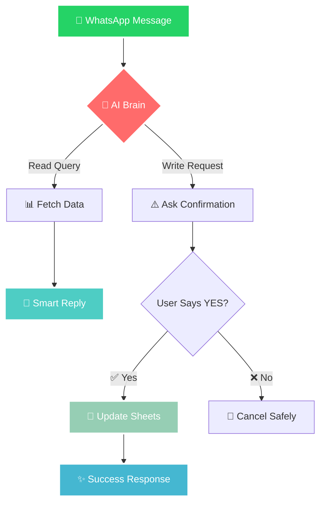
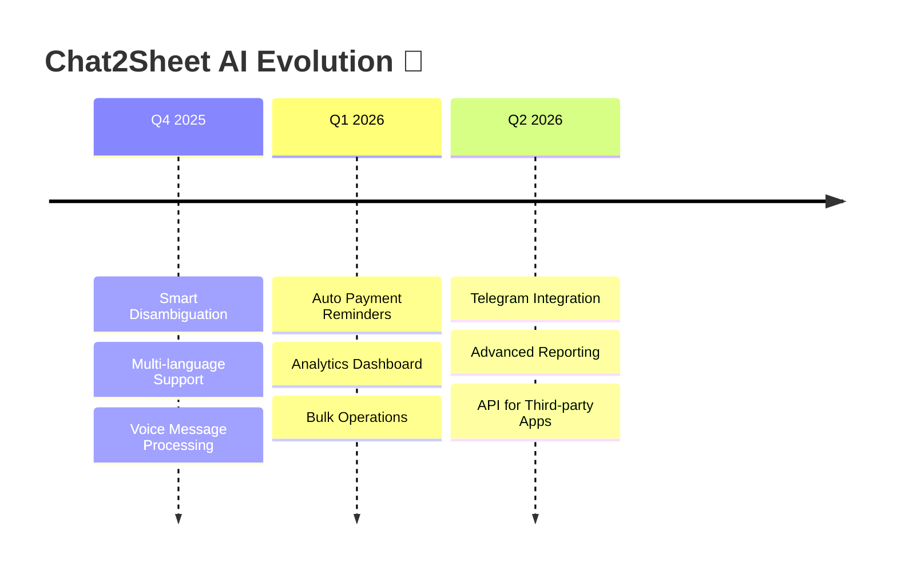

<div align="center">

# 🤖 Chat2Sheet AI

### _Where Conversations Meet Spreadsheets_

Transform casual WhatsApp chats into structured Google Sheets data — **no forms, no training, just talk.**

<div style="background: linear-gradient(135deg, #667eea 0%, #764ba2 100%); padding: 20px; border-radius: 15px; margin: 20px 0;">

**✨ Built with passion by ✨**

<table style="border: none; background: transparent;">
<tr>
<td align="center" style="border: none; background: transparent; padding: 20px;">

<br><br>
<strong style="color: #fff; font-size: 18px;">Yash Pandey</strong><br>
<a href="https://github.com/yassshhhh22" style="color: #b8f2ff; text-decoration: none; font-weight: bold;">@yassshhhh22</a><br>
<span style="color: #e0e0e0; font-style: italic;">🧠 AI Architect & Vision</span>
</td>
<td align="center" style="border: none; background: transparent; padding: 20px;">

<br><br>
<strong style="color: #fff; font-size: 18px;">Anuj Pal</strong><br>
<a href="https://github.com/anuj-1402" style="color: #b8f2ff; text-decoration: none; font-weight: bold;">@anuj-1402</a><br>
<span style="color: #e0e0e0; font-style: italic;">⚡ Integration Wizard & Flow</span>
</td>
</tr>
</table>

</div>

[✨ Features](#features) • [🚀 Quick Start](#quick-start) • [💬 Chat Examples](#examples) • [🔄 Flow](#how-it-works)

---

_"Add 10k for Aanya, Class 6, UPI today"_ → **Boom!** Your sheet is updated, balances calculated, confirmations sent.

</div>

---

## 🎯 The Magic



---

## ✨ Features

<div style="display: grid; grid-template-columns: 1fr 1fr; gap: 20px; margin: 20px 0;">

<div style="background: linear-gradient(135deg, #f093fb 0%, #f5576c 100%); padding: 25px; border-radius: 15px; color: white; box-shadow: 0 8px 25px rgba(240, 147, 251, 0.3);">

### 🗣️ **Natural Language First**

- _"Fee status for Rohan"_
- _"Add 5000 cash for Priya today"_
- _"Show me Class 8 payments this month"_

**No commands to memorize. Just chat.**

</div>

<div style="background: linear-gradient(135deg, #4facfe 0%, #00f2fe 100%); padding: 25px; border-radius: 15px; color: white; box-shadow: 0 8px 25px rgba(79, 172, 254, 0.3);">

### 🛡️ **Safety by Design**

- Confirms before any changes
- Shows exactly what will be saved
- Easy to cancel with "NO"

**Your data stays protected.**

</div>

<div style="background: linear-gradient(135deg, #43e97b 0%, #38f9d7 100%); padding: 25px; border-radius: 15px; color: white; box-shadow: 0 8px 25px rgba(67, 233, 123, 0.3);">

### ⚡ **Smart Responses**

- Formatted, readable replies
- Balance calculations
- Payment summaries
- Class reports

**Information you can actually use.**

</div>

<div style="background: linear-gradient(135deg, #fa709a 0%, #fee140 100%); padding: 25px; border-radius: 15px; color: white; box-shadow: 0 8px 25px rgba(250, 112, 154, 0.3);">

### 🎯 **Zero Learning Curve**

- Works on any WhatsApp
- No app downloads
- No new passwords
- Just add the bot number

**Ready in 30 seconds.**

</div>

</div>

---

## 🔄 How It Works

<div style="background: linear-gradient(135deg, #667eea 0%, #764ba2 100%); padding: 30px; border-radius: 20px; color: white; margin: 20px 0; box-shadow: 0 10px 30px rgba(102, 126, 234, 0.3);">

```
┌─────────────────────────────────────────────────────────────────┐
│                    🎭 THE AI CONVERSATION FLOW                  │
└─────────────────────────────────────────────────────────────────┘

📱 You: "Add 2500 for Riya, Class 7, cash today"
           │
           ▼
🧠 AI: Understands → Student: Riya | Amount: ₹2,500 | Mode: Cash
           │
           ▼
⚠️  AI: "Confirm to add ₹2,500 cash for Riya (Class 7) today?
        Reply YES to proceed"
           │
           ▼
📱 You: "YES"
           │
           ▼
✅ AI: "Added ✨ | Riya's new balance: ₹12,500 remaining"

┌─────────────────────────────────────────────────────────────────┐
│                    🔧 BEHIND THE SCENES                        │
└─────────────────────────────────────────────────────────────────┘

[WhatsApp] → [AI Parser] → [Confirmation] → [Google Sheets] → [Response]
     ↓             ↓              ↓               ↓              ↓
  Receives     Extracts      Asks user      Updates rows     Sends result
  message      intent &      to confirm     & calculates     back to chat
               details                      balances
```

</div>

---

## 💬 Examples

<details style="background: linear-gradient(135deg, #ffecd2 0%, #fcb69f 100%); padding: 20px; border-radius: 10px; margin: 10px 0; box-shadow: 0 5px 15px rgba(255, 236, 210, 0.5);">
<summary><strong>💰 Adding Payments</strong></summary>

```
You: "Add 15000 for Aarav 9th class UPI today"
Bot: "Confirm to add ₹15,000 UPI payment for Aarav (Class 9) today? Reply YES"

You: "YES"
Bot: "Payment added ✅
     Student: Aarav (Class 9)
     Amount: ₹15,000 (UPI)
     New balance: ₹5,000 remaining"
```

</details>

<details style="background: linear-gradient(135deg, #a8edea 0%, #fed6e3 100%); padding: 20px; border-radius: 10px; margin: 10px 0; box-shadow: 0 5px 15px rgba(168, 237, 234, 0.5);">
<summary><strong>📊 Checking Status</strong></summary>

```
You: "Fee status Meera"
Bot: "📋 Meera's Fee Status
     Total Fees: ₹25,000
     Paid: ₹18,000
     Balance: ₹7,000
     Status: Pending
     Last payment: ₹5,000 on 15-Aug-2025"
```

</details>

<details style="background: linear-gradient(135deg, #d299c2 0%, #fef9d7 100%); padding: 20px; border-radius: 10px; margin: 10px 0; box-shadow: 0 5px 15px rgba(210, 153, 194, 0.5);">
<summary><strong>📈 Class Reports</strong></summary>

```
You: "Class 8 summary"
Bot: "📊 Class 8 Fee Summary
     Total Students: 25
     Total Collected: ₹4,50,000
     Outstanding: ₹1,25,000
     Fully Paid: 18 students
     Pending: 7 students"
```

</details>

---

## 🚀 Quick Start

<div style="background: linear-gradient(135deg, #89f7fe 0%, #66a6ff 100%); padding: 25px; border-radius: 15px; color: white; margin: 20px 0; box-shadow: 0 8px 25px rgba(137, 247, 254, 0.3);">

### Prerequisites

- Node.js 18+
- WhatsApp Business API access
- Google Sheets API credentials
- Groq API key

</div>

### Installation

```bash
# Clone the magic ✨
git clone https://github.com/yourusername/chat2sheet-ai
cd chat2sheet-ai

# Install dependencies 📦
npm install

# Set up your environment 🔧
cp .env.example .env
# Fill in your API keys and credentials

# Start the AI 🚀
npm run dev  # Development with auto-reload
npm start    # Production
```

### Environment Setup

```env
PORT=3000
SPREADSHEET_ID=your_google_sheet_id
GOOGLE_CREDENTIALS_FILE=./credentials.json
GROQ_API_KEY=your_groq_api_key
WHATSAPP_ACCESS_TOKEN=your_whatsapp_token
WHATSAPP_PHONE_NUMBER_ID=your_phone_id
WHATSAPP_VERIFY_TOKEN=your_verify_token
```

---

## 🏗️ Architecture

<div style="background: linear-gradient(135deg, #ff9a9e 0%, #fecfef 100%); padding: 25px; border-radius: 15px; color: white; margin: 20px 0; box-shadow: 0 8px 25px rgba(255, 154, 158, 0.3);">

```
┌─────────────────┐    ┌─────────────────┐    ┌─────────────────┐
│   WhatsApp      │    │   Chat2Sheet    │    │  Google Sheets  │
│   Messages      │◄──►│      AI         │◄──►│     Data        │
└─────────────────┘    └─────────────────┘    └─────────────────┘
                              │
                              ▼
                       ┌─────────────────┐
                       │   Groq AI       │
                       │   (Language     │
                       │   Understanding)│
                       └─────────────────┘
```

**Core Components:**

- 🎯 **Classifier**: Determines read vs write intent
- 🧠 **Parser**: Extracts structured data from natural language
- 🛡️ **Confirmation Engine**: Safe write operations
- 📊 **Sheets Manager**: CRUD operations with smart updates
- 💬 **Response Generator**: Friendly, formatted replies

</div>

---

## 🎨 Customization

<details style="background: linear-gradient(135deg, #fdbb2d 0%, #22c1c3 100%); padding: 20px; border-radius: 10px; margin: 10px 0; box-shadow: 0 5px 15px rgba(253, 187, 45, 0.3);">
<summary><strong>🔧 Adding New Query Types</strong></summary>

Edit `src/services/classifierService.js` to recognize new patterns:

```javascript
const queryTypes = {
  // Add your custom queries
  attendance_report: ["attendance", "present", "absent"],
  fee_reminders: ["remind", "pending", "overdue"],
};
```

</details>

<details style="background: linear-gradient(135deg, #ee9ca7 0%, #ffdde1 100%); padding: 20px; border-radius: 10px; margin: 10px 0; box-shadow: 0 5px 15px rgba(238, 156, 167, 0.3);">
<summary><strong>🎭 Customizing AI Responses</strong></summary>

Modify response templates in `src/services/whatsappService.js`:

```javascript
const responseTemplates = {
  success: "✅ Done! {details}",
  confirmation: "⚠️ Confirm: {action}? Reply YES",
  error: "❌ Oops! {error_message}",
};
```

</details>

---

## 🚀 Roadmap

<div style="background: linear-gradient(135deg, #667eea 0%, #764ba2 100%); padding: 25px; border-radius: 15px; color: white; margin: 20px 0; box-shadow: 0 8px 25px rgba(102, 126, 234, 0.3);">



</div>

---

## 🤝 Our Amazing Team

<div style="background: linear-gradient(135deg, #667eea 0%, #764ba2 100%); padding: 30px; border-radius: 20px; margin: 30px 0; box-shadow: 0 15px 40px rgba(102, 126, 234, 0.4);">

<div align="center">

**💫 The Dream Team Behind Chat2Sheet AI 💫**

<table style="border: none; background: transparent; width: 100%;">
<tr>
<td align="center" style="border: none; background: transparent; padding: 30px;">
<div style="position: relative;">

<div style="position: absolute; bottom: 0; right: 0; background: linear-gradient(45deg, #FF6B6B, #4ECDC4); width: 30px; height: 30px; border-radius: 50%; border: 3px solid #fff; display: flex; align-items: center; justify-content: center;">🧠</div>
</div>
<br><br>
<h3 style="color: #fff; margin: 10px 0; font-size: 24px;">Yash Pandey</h3>
<a href="https://github.com/yassshhhh22" style="color: #b8f2ff; text-decoration: none; font-weight: bold; font-size: 18px;">@yassshhhh22</a><br><br>
<div style="background: rgba(255,255,255,0.2); padding: 15px; border-radius: 10px; margin-top: 15px;">
<strong style="color: #fff;">🎯 AI Architect & Vision</strong><br>
<span style="color: #e0e0e0; font-style: italic; line-height: 1.5;">Crafted the intelligent conversation engine that makes natural language processing feel like magic</span>
</div>
</td>
<td align="center" style="border: none; background: transparent; padding: 30px;">
<div style="position: relative;">

<div style="position: absolute; bottom: 0; right: 0; background: linear-gradient(45deg, #45B7D1, #96CEB4); width: 30px; height: 30px; border-radius: 50%; border: 3px solid #fff; display: flex; align-items: center; justify-content: center;">⚡</div>
</div>
<br><br>
<h3 style="color: #fff; margin: 10px 0; font-size: 24px;">Anuj Pal</h3>
<a href="https://github.com/anuj-1402" style="color: #b8f2ff; text-decoration: none; font-weight: bold; font-size: 18px;">@anuj-1402</a><br><br>
<div style="background: rgba(255,255,255,0.2); padding: 15px; border-radius: 10px; margin-top: 15px;">
<strong style="color: #fff;">🔗 Integration Wizard & Flow</strong><br>
<span style="color: #e0e0e0; font-style: italic; line-height: 1.5;">Built the seamless bridges between WhatsApp, AI, and Google Sheets that make it all work</span>
</div>
</td>
</tr>
</table>

<div style="margin-top: 30px; padding: 20px; background: rgba(255,255,255,0.1); border-radius: 15px;">
<h4 style="color: #fff; margin-bottom: 15px;">🌟 Want to join our mission?</h4>
<p style="color: #e0e0e0; margin-bottom: 15px;">We're always looking for passionate developers who believe in making technology more human.</p>
<a href="CONTRIBUTING.md" style="color: #b8f2ff; text-decoration: none; font-weight: bold; background: rgba(255,255,255,0.2); padding: 10px 20px; border-radius: 25px; display: inline-block;">📝 Contributing Guide</a>
</div>

</div>

</div>

---

## 📝 License

<div style="background: linear-gradient(135deg, #ffecd2 0%, #fcb69f 100%); padding: 20px; border-radius: 10px; text-align: center; margin: 20px 0; box-shadow: 0 5px 15px rgba(255, 236, 210, 0.5);">

**ISC License** - Use it, modify it, make it yours! 🎉

</div>

---

<div align="center" style="background: linear-gradient(135deg, #667eea 0%, #764ba2 100%); padding: 40px; border-radius: 20px; color: white; margin: 30px 0; box-shadow: 0 15px 40px rgba(102, 126, 234, 0.4);">

### ⭐ **Star us if Chat2Sheet AI made your life easier!** ⭐

<div style="font-size: 20px; margin: 20px 0;">
🎯 • 💬 • 📊 • ✨
</div>

_Made with ❤️ for schools, institutes, and anyone who believes data entry should be a conversation, not a chore._

<div style="margin-top: 25px;">
<a href="https://github.com/yourusername/chat2sheet-ai/stargazers" style="color: #b8f2ff; text-decoration: none; margin: 0 10px;">⭐ Star</a> •
<a href="https://github.com/yourusername/chat2sheet-ai/fork" style="color: #b8f2ff; text-decoration: none, margin: 0 10px;">🍴 Fork</a> •
<a href="https://github.com/yourusername/chat2sheet-ai/issues" style="color: #b8f2ff; text-decoration: none, margin: 0 10px;">🐛 Issues</a>
</div>
