<div align="center">

# 🕷️ Chat2Sheet AI

### _Where Conversations Meet Spreadsheets_

Transform casual WhatsApp chats into structured Google Sheets data — **no forms, no training, just talk.**

<div style="background: linear-gradient(135deg, #1a1a1a 0%, #2d1b1b 100%); padding: 20px; border-radius: 15px; margin: 20px 0; border: 1px solid #4a0e0e;">

**⚡ Built with precision by ⚡**

<table style="border: none; background: transparent;">
<tr>
<td align="center" style="border: none; background: transparent; padding: 20px;">

<br><br>
<strong style="color: #f5f5f5; font-size: 18px;">Yash Pandey</strong><br>
<a href="https://github.com/yassshhhh22" style="color: #cc5555; text-decoration: none; font-weight: bold;">@yassshhhh22</a><br>
<span style="color: #999; font-style: italic;">🧠 AI Architect & Vision</span>
</td>
<td align="center" style="border: none; background: transparent; padding: 20px;">

<br><br>
<strong style="color: #f5f5f5; font-size: 18px;">Anuj Pal</strong><br>
<a href="https://github.com/anuj-1402" style="color: #cc5555; text-decoration: none; font-weight: bold;">@anuj-1402</a><br>
<span style="color: #999; font-style: italic;">⚡ Integration Wizard & Flow</span>
</td>
</tr>
</table>

</div>

[🎯 Features](#features) • [🚀 Quick Start](#quick-start) • [💬 Chat Examples](#examples) • [🔄 Flow](#how-it-works)

---

_"Add 10k for Aanya, Class 6, UPI today"_ → **Boom!** Your sheet is updated, balances calculated, confirmations sent.

</div>

---

## 🎯 The Magic

```mermaid
graph TD
    A[💬 WhatsApp Message] --> B{🧠 AI Classifier}
    B -->|Read Query| C[📊 Smart Query Parser]
    B -->|Write Request| D[⚠️ Safety Confirmation]
    C --> E{Query Type}
    E -->|Student Details| F[👨‍🎓 Individual Info]
    E -->|Fee Status| G[💰 Payment Status]
    E -->|Payment History| H[📈 Transaction Records]
    E -->|Class Reports| I[📚 Bulk Analysis]
    E -->|Date-based| J[📅 Time-filtered Data]
    D --> K{User Confirms?}
    K -->|✅ Yes| L[📝 Update Sheets]
    K -->|❌ No| M[🚫 Cancel Safely]
    F --> N[📱 Formatted Response]
    G --> N
    H --> N
    I --> N
    J --> N
    L --> O[✨ Success + Auto-calculation]

    style A fill:#2d1b1b,stroke:#8b0000,stroke-width:3px,color:#fff
    style B fill:#1a1a1a,stroke:#666,stroke-width:3px,color:#fff
    style N fill:#3d2a2a,stroke:#8b0000,stroke-width:3px,color:#fff
    style O fill:#4a1515,stroke:#8b0000,stroke-width:3px,color:#fff
    style L fill:#2a3d2a,stroke:#555,stroke-width:3px,color:#fff
```



---

## 🎯 Features

<div style="display: grid; grid-template-columns: 1fr 1fr; gap: 20px; margin: 20px 0;">

<div style="background: linear-gradient(135deg, #2d1b1b 0%, #1a1a1a 100%); padding: 25px; border-radius: 15px; color: #f5f5f5; box-shadow: 0 8px 25px rgba(45, 27, 27, 0.5); border: 1px solid #4a0e0e;">

### 🗣️ **Advanced Natural Language**

- _"Fee status for Rohan"_
- _"All payments by STU1235"_
- _"Students in class 11 with balance > 15000"_
- _"Payments received today"_
- _"Show me outstanding fees report"_

**Understands context, dates, and complex queries.**

</div>

<div style="background: linear-gradient(135deg, #1a1a1a 0%, #2d2d2d 100%); padding: 25px; border-radius: 15px; color: #f5f5f5; box-shadow: 0 8px 25px rgba(26, 26, 26, 0.5); border: 1px solid #555;">

### 🛡️ **Enterprise-Grade Safety**

- Smart confirmation before any changes
- Shows exact data preview
- Prevents accidental operations
- Detailed audit trails

**Zero chance of data corruption.**

</div>

<div style="background: linear-gradient(135deg, #1a2d1a 0%, #2d2d1a 100%); padding: 25px; border-radius: 15px; color: #f5f5f5; box-shadow: 0 8px 25px rgba(26, 45, 26, 0.5); border: 1px solid #4a4a0e;">

### ⚡ **Intelligent Responses**

- Auto-formatted WhatsApp messages
- Real-time balance calculations
- Comprehensive payment histories
- Date-based transaction reports
- Class-wise analytics

**Information that's immediately actionable.**

</div>

<div style="background: linear-gradient(135deg, #2d1a1a 0%, #1a1a2d 100%); padding: 25px; border-radius: 15px; color: #f5f5f5; box-shadow: 0 8px 25px rgba(45, 26, 26, 0.5); border: 1px solid #4a0e4a;">

### 🎯 **Multi-Query Intelligence**

- Student search by name/ID/class
- Date-range payment reports
- Outstanding fee analysis
- Class performance summaries
- Individual vs aggregate queries

**One AI handles everything.**

</div>

</div>

---

## 🔄 How It Works

<div style="background: linear-gradient(135deg, #1a1a1a 0%, #2d1b1b 100%); padding: 30px; border-radius: 20px; color: #f5f5f5; margin: 20px 0; box-shadow: 0 10px 30px rgba(26, 26, 26, 0.5); border: 1px solid #4a0e0e;">

```
┌─────────────────────────────────────────────────────────────────┐
│                🕷️ THE ADVANCED AI CONVERSATION FLOW             │
└─────────────────────────────────────────────────────────────────┘

📱 You: "Students in class 12 with outstanding fees"
           │
           ▼
🧠 AI Classifier: Identifies → READ operation, aggregate_summary type
           │
           ▼
🔍 Query Parser: Extracts → class: "12", criteria: "outstanding_fees"
           │
           ▼
📊 Smart Filter: Processes → Finds 8 students with pending balances
           │
           ▼
✨ Response: "📚 Class 12 Outstanding Fees Report (8 students):
            • Rahul (STU201) - Balance: ₹15,000
            • Priya (STU202) - Balance: ₹8,500
            ... (shows all)
            💰 Total Outstanding: ₹89,500"

┌─────────────────────────────────────────────────────────────────┐
│                    🧠 ADVANCED AI CAPABILITIES                  │
└─────────────────────────────────────────────────────────────────┘

✅ Multi-step query understanding
✅ Context-aware response formatting
✅ Automatic data aggregation
✅ Date intelligence (today, yesterday, ranges)
✅ Smart disambiguation between similar queries
✅ Real-time sheet calculations
```

</div>

---

## 💬 Advanced Examples

<details style="background: linear-gradient(135deg, #2d2d1a 0%, #1a1a1a 100%); padding: 20px; border-radius: 10px; margin: 10px 0; box-shadow: 0 5px 15px rgba(45, 45, 26, 0.5); border: 1px solid #4a4a0e;">
<summary><strong>💰 Smart Payment Processing</strong></summary>

```
You: "Add 15000 for Aarav 9th class UPI today with remarks exam fees"
Bot: "⚠️ Confirmation Required

     💳 Payment Details:
     • Amount: ₹15,000
     • Student: Aarav (Class 9)
     • Mode: UPI
     • Date: 2025-08-22
     • Remarks: exam fees

     Reply YES to confirm or NO to cancel."

You: "YES"
Bot: "✅ Payment processed successfully!

     💰 Updated Balance:
     • Previous: ₹20,000
     • Paid: ₹15,000
     • New Balance: ₹5,000

     📊 Data updated in sheets!"
```

</details>

<details style="background: linear-gradient(135deg, #1a1a2d 0%, #2d1a2d 100%); padding: 20px; border-radius: 10px; margin: 10px 0; box-shadow: 0 5px 15px rgba(26, 26, 45, 0.5); border: 1px solid #0e0e4a;">
<summary><strong>📊 Advanced Analytics</strong></summary>

```
You: "Students in class 11 with fees paid less than 10000"
Bot: "📊 Class 11 Fee Analysis

     🔍 Students with paid fees < ₹10,000:

     1. Ravi (STU301) - Class 11
        Paid: ₹8,500, Balance: ₹16,500

     2. Sneha (STU302) - Class 11
        Paid: ₹6,000, Balance: ₹19,000

     3. Kiran (STU303) - Class 11
        Paid: ₹9,200, Balance: ₹15,800

     📈 Summary:
     • Total Count: 3 students
     • Total Outstanding: ₹51,300"
```

</details>

<details style="background: linear-gradient(135deg, #2d1a1a 0%, #1a2d1a 100%); padding: 20px; border-radius: 10px; margin: 10px 0; box-shadow: 0 5px 15px rgba(45, 26, 26, 0.5); border: 1px solid #4a0e0e;">
<summary><strong>📈 Date-Based Reports</strong></summary>

```
You: "All payments received today"
Bot: "📅 Today's Payment Report

     📈 Total Payments: 5

     1. Amit (STU101)
        🆔 Installment ID: INST567
        💰 Amount: ₹12,000
        💳 Mode: UPI
        📝 Remarks: First installment

     2. Reeta (STU145)
        🆔 Installment ID: INST568
        💰 Amount: ₹8,500
        💳 Mode: Cash

     ... (shows all payments)

     💰 Total Amount Collected: ₹45,500"
```

</details>

<details style="background: linear-gradient(135deg, #1a1a1a 0%, #2d1b1b 100%); padding: 20px; border-radius: 10px; margin: 10px 0; box-shadow: 0 5px 15px rgba(26, 26, 26, 0.5); border: 1px solid #4a0e0e; color: #f5f5f5;">
<summary><strong>🎯 Individual Student Intelligence</strong></summary>

```
You: "Payment history of STU1235"
Bot: "📈 Payment History for Rahul Singh

     1. 🆔 INST789
        💰 Amount: ₹15,000
        📅 Date: 2025-08-15
        💳 Mode: UPI
        📝 Remarks: First installment

     2. 🆔 INST823
        💰 Amount: ₹10,000
        📅 Date: 2025-07-20
        💳 Mode: Cash
        📝 Remarks: Admission fees

     💰 Total Paid: ₹25,000
     📊 Current Balance: ₹15,000"
```

</details>

---

## 🚀 Quick Start

<div style="background: linear-gradient(135deg, #1a1a1a 0%, #2d2d2d 100%); padding: 25px; border-radius: 15px; color: #f5f5f5; margin: 20px 0; box-shadow: 0 8px 25px rgba(26, 26, 26, 0.5); border: 1px solid #555;">

### Prerequisites

- Node.js 18+
- WhatsApp Business API access
- Google Sheets API credentials
- Groq API key (for advanced AI)

</div>

### Installation

```bash
# Clone the magic ✨
git clone https://github.com/yourusername/chat2sheet-ai
cd chat2sheet-ai

# Install dependencies 📦
npm install

# Set up your environment 🔧
cp .env.example .env
# Fill in your API keys and credentials

# Start the AI 🚀
npm run dev  # Development with auto-reload
npm start    # Production
```

### Environment Setup

```env
PORT=3000
NODE_ENV=production
SPREADSHEET_ID=your_google_sheet_id
GOOGLE_CREDENTIALS_FILE=./credentials.json
GROQ_API_KEY=your_groq_api_key
WHATSAPP_ACCESS_TOKEN=your_whatsapp_token
WHATSAPP_PHONE_NUMBER_ID=your_phone_id
WHATSAPP_VERIFY_TOKEN=your_verify_token
```

---

## 🏗️ Advanced Architecture

<div style="background: linear-gradient(135deg, #2d1b1b 0%, #1a1a1a 100%); padding: 25px; border-radius: 15px; color: #f5f5f5; margin: 20px 0; box-shadow: 0 8px 25px rgba(45, 27, 27, 0.5); border: 1px solid #4a0e0e;">

```
┌─────────────────┐    ┌─────────────────┐    ┌─────────────────┐
│   WhatsApp      │    │   Chat2Sheet    │    │  Google Sheets  │
│   Messages      │◄──►│      AI         │◄──►│   Live Data     │
└─────────────────┘    └─────────────────┘    └─────────────────┘
                              │
                              ▼
                       ┌─────────────────┐
                       │   Groq AI       │
                       │  Multi-Model    │
                       │   Processing    │
                       └─────────────────┘
```

**Advanced Components:**

- 🎯 **Intent Classifier**: Distinguishes read vs write operations
- 🧠 **Multi-Query Parser**: Handles complex, nested queries
- 🛡️ **Safety Engine**: Multi-layer confirmation system
- 📊 **Analytics Engine**: Real-time aggregation and filtering
- 💬 **Smart Responder**: Context-aware message formatting
- 🔄 **Keep-Alive Service**: Production stability monitoring

</div>

### Query Processing Pipeline


---

## 🎨 Advanced Customization

<details style="background: linear-gradient(135deg, #2d2d1a 0%, #1a1a1a 100%); padding: 20px; border-radius: 10px; margin: 10px 0; box-shadow: 0 5px 15px rgba(45, 45, 26, 0.5); border: 1px solid #4a4a0e;">
<summary><strong>🔧 Adding Custom Query Types</strong></summary>

Edit `src/services/readAiService.js` to add new query patterns:

```javascript
// Add to the prompt
For attendance tracking:
{"query_type": "attendance_report", "parameters": {"class": "12", "date_filter": "today"}, "output_format": "detailed"}

For fee reminders:
{"query_type": "reminder_status", "parameters": {"criteria": "overdue_30_days"}, "output_format": "list"}
```

Then implement in `src/controllers/readController.js`:

```javascript
case "attendance_report":
  return await getAttendanceReport(parameters, output_format);

case "reminder_status":
  return await getReminderStatus(parameters, output_format);
```

</details>

<details style="background: linear-gradient(135deg, #2d1a1a 0%, #1a1a2d 100%); padding: 20px; border-radius: 10px; margin: 10px 0; box-shadow: 0 5px 15px rgba(45, 26, 26, 0.5); border: 1px solid #4a0e0e;">
<summary><strong>🎭 Response Template Customization</strong></summary>

Modify `src/services/whatsappService.js` to customize responses:

```javascript
// Student details template
case "student_details":
  if (result.data) {
    message += `👨‍🎓 *Student Profile:*\n`;
    message += `🆔 ID: ${result.data.stud_id}\n`;
    message += `📛 Name: ${result.data.name}\n`;
    message += `🎓 Class: ${result.data.class}\n`;
    message += `👨‍👩‍👧‍👦 Parent: ${result.data.parent_name}\n`;
    message += `📱 Phone: ${result.data.phone_no}\n`;
    if (result.data.email) message += `📧 Email: ${result.data.email}\n`;

    // Add custom fields
    if (result.data.admission_date) message += `📅 Admission: ${result.data.admission_date}\n`;
    if (result.data.stream) message += `🎯 Stream: ${result.data.stream}\n`;
  }
```

</details>

---

## 🚀 Enhanced Roadmap

```mermaid
timeline
    title Chat2Sheet AI Evolution 🚀

    Q4 2025 : Smart Auto-Complete
            : Multi-language Support
            : Voice Message Processing
            : Advanced Analytics Dashboard

    Q1 2026 : Intelligent Payment Reminders
            : Predictive Fee Analysis
            : Bulk Import/Export
            : Custom Report Builder

    Q2 2026 : Telegram & Discord Integration
            : Mobile App Companion
            : Advanced Security Features
            : Multi-Institution Support

    Q3 2026 : AI-Powered Insights
            : Automated Report Generation
            : Integration Marketplace
            : Enterprise SSO
```

<div style="background: linear-gradient(135deg, #1a1a1a 0%, #2d1b1b 100%); padding: 25px; border-radius: 15px; color: #f5f5f5; margin: 20px 0; box-shadow: 0 8px 25px rgba(26, 26, 26, 0.5); border: 1px solid #4a0e0e;">



</div>

---

## 📚 Complete Query Reference

<div style="background: linear-gradient(135deg, #1a1a1a 0%, #2d2d2d 100%); padding: 25px; border-radius: 15px; color: #f5f5f5; margin: 20px 0; border: 1px solid #555;">

### 📖 Read Operations

```
Individual Queries:
• "Details of STU1234"
• "Fee status for Rahul"
• "Payment history of Priya"

Class Queries:
• "Students in class 12"
• "Class 11 fee summary"

Date-based Queries:
• "Payments received today"
• "All payments on 2025-08-22"
• "Payments between 2025-08-01 and 2025-08-31"

Analytics Queries:
• "Students with outstanding fees"
• "Students who paid less than 10000"
• "Class 10 students with balance more than 15000"
```

### ✏️ Write Operations

```
Student Registration:
• "Add student Amit Kumar, class 12, parent: Mr Kumar, phone: 9999999999, fees: 50000"

Payment Recording:
• "Add 15000 for STU1234 UPI today"
• "Student STU1235 paid 8000 cash yesterday with remarks exam fees"
```

</div>

---

## 🤝 Our Amazing Team

<div style="background: linear-gradient(135deg, #1a1a1a 0%, #2d1b1b 100%); padding: 30px; border-radius: 20px; margin: 30px 0; box-shadow: 0 15px 40px rgba(26, 26, 26, 0.6); border: 1px solid #4a0e0e;">

<div align="center">

**🕷️ The Elite Team Behind Chat2Sheet AI 🕷️**

<table style="border: none; background: transparent; width: 100%;">
<tr>
<td align="center" style="border: none; background: transparent; padding: 30px;">
<div style="position: relative;">

<div style="position: absolute; bottom: 0; right: 0; background: linear-gradient(45deg, #8b0000, #4a0e0e); width: 30px; height: 30px; border-radius: 50%; border: 3px solid #1a1a1a; display: flex; align-items: center; justify-content: center;">🧠</div>
</div>
<br><br>
<h3 style="color: #f5f5f5; margin: 10px 0; font-size: 24px;">Yash Pandey</h3>
<a href="https://github.com/yassshhhh22" style="color: #cc5555; text-decoration: none; font-weight: bold; font-size: 18px;">@yassshhhh22</a><br><br>
<div style="background: rgba(26,26,26,0.7); padding: 15px; border-radius: 10px; margin-top: 15px; border: 1px solid #4a0e0e;">
<strong style="color: #f5f5f5;">🎯 AI Architect & Vision</strong><br>
<span style="color: #999; font-style: italic; line-height: 1.5;">Crafted the intelligent conversation engine that makes natural language processing feel like magic</span>
</div>
</td>
<td align="center" style="border: none; background: transparent; padding: 30px;">
<div style="position: relative;">

<div style="position: absolute; bottom: 0; right: 0; background: linear-gradient(45deg, #4a0e0e, #2d1b1b); width: 30px; height: 30px; border-radius: 50%; border: 3px solid #1a1a1a; display: flex; align-items: center; justify-content: center;">⚡</div>
</div>
<br><br>
<h3 style="color: #f5f5f5; margin: 10px 0; font-size: 24px;">Anuj Pal</h3>
<a href="https://github.com/anuj-1402" style="color: #cc5555; text-decoration: none; font-weight: bold; font-size: 18px;">@anuj-1402</a><br><br>
<div style="background: rgba(26,26,26,0.7); padding: 15px; border-radius: 10px; margin-top: 15px; border: 1px solid #4a0e0e;">
<strong style="color: #f5f5f5;">🔗 Integration Wizard & Flow</strong><br>
<span style="color: #999; font-style: italic; line-height: 1.5;">Built the seamless bridges between WhatsApp, AI, and Google Sheets that make it all work</span>
</div>
</td>
</tr>
</table>

<div style="margin-top: 30px; padding: 20px; background: rgba(26,26,26,0.6); border-radius: 15px; border: 1px solid #333;">
<h4 style="color: #f5f5f5; margin-bottom: 15px;">🌟 Want to join our mission?</h4>
<p style="color: #999; margin-bottom: 15px;">We're always looking for passionate developers who believe in making technology more human.</p>
<a href="CONTRIBUTING.md" style="color: #cc5555; text-decoration: none; font-weight: bold; background: rgba(26,26,26,0.8); padding: 10px 20px; border-radius: 25px; display: inline-block; border: 1px solid #4a0e0e;">📝 Contributing Guide</a>
</div>

</div>

</div>

---

## 📝 License

<div style="background: linear-gradient(135deg, #2d2d1a 0%, #1a1a1a 100%); padding: 20px; border-radius: 10px; text-align: center; margin: 20px 0; box-shadow: 0 5px 15px rgba(45, 45, 26, 0.5); border: 1px solid #4a0e0e;">

**ISC License** - Use it, modify it, make it yours! 🎉

</div>

---

<div align="center" style="background: linear-gradient(135deg, #1a1a1a 0%, #2d1b1b 100%); padding: 40px; border-radius: 20px; color: #f5f5f5; margin: 30px 0; box-shadow: 0 15px 40px rgba(26, 26, 26, 0.6); border: 1px solid #4a0e0e;">

### ⭐ **Star us if Chat2Sheet AI revolutionized your workflow!** ⭐

<div style="font-size: 20px; margin: 20px 0;">
🎯 • 💬 • 📊 • 🧠 • ✨
</div>

_Built for the future of conversational data management._  
_Where natural language meets intelligent automation._

<div style="margin-top: 25px;">
<a href="https://github.com/yourusername/chat2sheet-ai/stargazers" style="color: #cc5555; text-decoration: none; margin: 0 10px;">⭐ Star</a> •
<a href="https://github.com/yourusername/chat2sheet-ai/fork" style="color: #cc5555; text-decoration: none, margin: 0 10px;">🍴 Fork</a> •
<a href="https://github.com/yourusername/chat2sheet-ai/issues" style="color: #cc5555; text-decoration: none, margin: 0 10px;">🐛 Issues</a>
</div>

</div>
